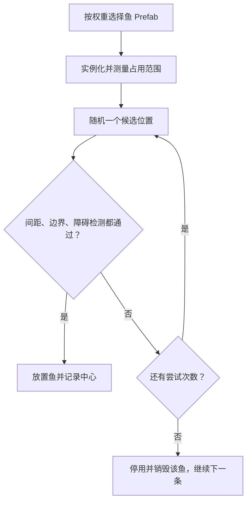
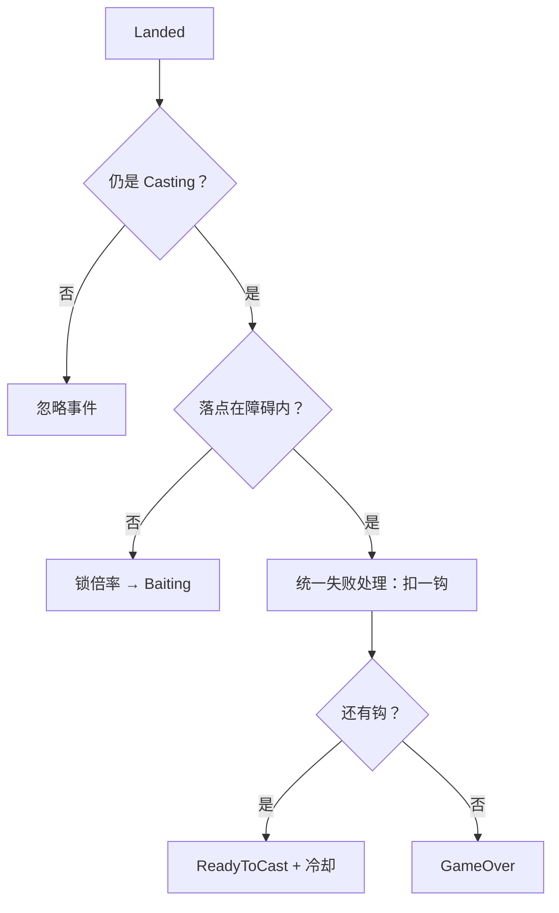

# 鱼生成避障与抛竿落点失败：实现复盘

记录日期：2026-09-09。依据本轮实际源码与场景接线，用于回头理解和重做。实施清单仍由 task_plan.md 管理。

## 1. 解决的问题

原来 FishSpawner 只检查鱼之间的中心距离，因此鱼仍可能生成在岩石中；鱼钩落水后直接进入 Baiting，没有判断落点是否在岩石上。

现在分两条规则：

- 生成：鱼的初始占用范围必须位于生成区域内，并且不与障碍 Collider 重叠。
- 落点：鱼钩落水点在障碍 Collider 内，则扣一钩；有钩则返回 ReadyToCast 并冷却，最后一钩则 GameOver。

本步没有实现游动避障、寻路、转向、逃离或捕食。鱼钩飞过岩石上方不会失败，只在落水时检查。

## 2. 代码阅读入口

以下路径相对于仓库根目录：

| 文件 | 重点方法 | 职责 |
|---|---|---|
| Assets/Scripts/Spawner/FishSpawner.cs | SpawnFish、GetSpawnFootprint、FitsSpawnArea | 选择品类、随机位置、检测鱼的范围 |
| Assets/Scripts/Obstacle/ReelingObstable.cs | ContainsPoint、OverlapsBounds、HasMarkedObstacle | 查询物理重叠，识别障碍标记 |
| Assets/Scripts/Controller/FishingLoopController.cs | HandleHookLanded、LoseHookAndFinishAttempt、TransitionTo | 落水结果、扣钩、冷却和状态转换 |
| Assets/Scripts/Controller/FishingHookController.cs | UpdateFlight | 飞行结束后报告一次 Landed |
| Assets/Scenes/FishingLoopTest.unity | FishSpawner、岩石对象 | 参数与 Collider 接线 |

注意：文件名 ReelingObstable.cs 有历史拼写错误，类名是 ReelingObstacle。本轮没有重命名。

## 3. 检测分两层：几何与身份

Physics2D 回答的是“查询区域与哪些 Collider2D 重叠”，它不知道哪个对象在玩法中是岩石。

1. OverlapPoint 查询落水点；OverlapBox 查询鱼的候选包围盒。
2. 对每个碰撞体调用 GetComponentInParent<ReelingObstacle>()。
3. 找到启用的障碍标记才返回 true。

这样生成区域自身的 Collider、鱼的 Collider 即使出现在结果里，也不会误算成岩石。标记可以在父物体、碰撞体在子物体。

ContactFilter2D 显式设置 useTriggers=true，不使用 LayerMask 过滤，再按标记筛选。因此能复用现有 Trigger 岩石，无需新增 Layer。

结果使用复用的 List<Collider2D>，避免每次创建结果数组；容量增长仍可能分配内存，并非完全零分配。当前静态结果列表用于 Unity 主线程同步查询，不支持并发使用。

### 为什么调用 SyncTransforms

Transform 刚修改或实例刚创建时，物理形状可能尚未同步。生成开始、新鱼实例化之后和落点查询之前，调用 Physics2D.SyncTransforms，让查询依据当前变换。

当前是启动生成、落水这样的低频操作。以后不要不加评估地把全局同步放进每条鱼的每帧 Update。

## 4. 生成算法：有限次拒绝采样

拒绝采样就是“随机提出一个位置，不合格就换一个”。次数有限，所以不保证目标数量一定生成成功。



### 4.1 为什么先选鱼，再选位置

小鱼、大鱼尺寸不同。先选一个空点再放大鱼，可能点合法、身体却放不下。

现在先实例化一次，直接测量 Variant 最终生效的 Sprite、Scale 和父级变换，避免从 Prefab 资产手工推算多层覆盖。不是每次位置尝试都实例化。

代价：失败的放置也会执行 Instantiate/Destroy；Awake/OnEnable 已发生。当前只在启动生成少量鱼。将来引入对象池或带外部副作用的初始化时，应重新设计测量与激活顺序。

### 4.2 包围盒 footprint

GetSpawnFootprint 从鱼根位置的零大小 Bounds 开始，合并：

- 根对象 SpriteRenderer 的世界 bounds。
- 鱼及其子物体上激活、启用的 Collider2D bounds。

不合并子对象水花和涟漪的 Renderer，避免把特效当成鱼体积。以后若主体 Renderer 移到子物体，这个假设需要调整。

结果是世界坐标轴对齐包围盒（AABB），不是精确鱼轮廓。对细长或斜向鱼会偏保守，这是当前简单实现的取舍。

随后执行 Expand(padding × 2)。Expand 增加总尺寸：希望左右各留 0.05，总宽就需增加 0.10。

### 4.3 为什么保留中心偏移

Sprite Pivot 或 Collider offset 可能让“鱼根位置”不等于“身体中心”。

```text
footprintOffset = 当前包围盒中心 - 当前鱼根位置
候选包围盒中心 = 候选鱼根位置 + footprintOffset
```

检测时只移动一份 Bounds 数据，不用每次真的移动鱼、同步物理。

### 4.4 三个通过条件

1. 与已生成鱼的中心间距足够：比较距离平方与 minimumSpawnSpacing²，避免开方。
2. 整个候选包围盒都在 spawnArea 内。
3. OverlapBox 没有检测到带标记的启用障碍。

第二项把四个世界角点通过 InverseTransformPoint 转入生成 BoxCollider2D 的局部空间，再减 collider.offset，与 size/2 比较。只检查中心不能保证身体不越界。

旋转生成区域后，从它的世界 AABB 取样会产生一些区域外候选，四角检查负责拒绝。适用于常规 XY 平面的 2D 场景，不适用于任意倾斜到三维空间的生成面。

### 4.5 参数与边界

当前主场景目标数量 25、中心间距 0.75、每鱼最多尝试 50 次、障碍边距 0.05。

没有合法位置则跳过该条鱼，后面仍继续尝试，最后汇总告警。数量可以少于目标；告警表示本次采样没找到位置，不代表数学上没有空位。

重要限制：

- 鱼之间仍按中心间距判断，不保证大鱼身体之间完全不重叠。
- 大鱼更难放置，最终实际品类比例可能偏离最初抽样权重。
- 空 Prefab 和非正权重被忽略；没有有效品类时停止生成。
- 遍历已有中心的最坏成本约为 O(尝试次数 × 鱼数量平方)，另有物理查询成本。大量生成时再评估空间网格或候选点池。
- 本次只保证初始放置；以后鱼会游动，需要另外处理运动中的边界和障碍。

## 5. 落点失败为什么放在协调层

FishingHookController 管飞行，报告 Landed；扣钩和状态去向由 FishingLoopController 管。

HandleHookLanded 的顺序：

1. 当前不是 Casting 就忽略。
2. 同步物理，检测 landingPosition。
3. 命中岩石则调用 LoseHookAndFinishAttempt，立即 return。
4. 未命中才计算、锁定倍率，保存落点，进入 Baiting。

return 很重要：否则扣钩失败后还可能继续启动咬钩流程。



落点是点检测。如果鱼钩中心在水里、图片边缘擦到岩石，当前不会判落点失败。要改为鱼钩体积检测，应先明确规则。

## 6. 冷却与重复事件

之前只有 Striking/Reeling 返回 ReadyToCast 会启动 PostAttemptCooldown。现在 Casting 也可能因落点失败直接返回，因此把它加入来源状态。

冷却在 EnterState 之前赋值，进入 ReadyToCast 时原有输入门控即可阻止抛竿。动画等待时间不能替代玩法冷却。

第一次失败后状态已改变，再收到重复 Landed 时，Casting 检查会拒绝，防止再次扣钩。这验证的是落点事件路径，不代表所有失败来源天然互斥。

## 7. 场景接线也是实现的一部分

本轮发现 98 个障碍标记对应 97 个对象，其中 4 个对象缺 Collider。只有标记没有几何形状，Physics2D 查不到。

补齐时按各 Sprite 实际裁切宽高 ÷ PPU、Center Pivot 添加 BoxCollider2D，沿用现有 Trigger 配置。没有改岩石美术位置、缩放、鱼 Variant 或权重。

检测以 Collider 为准，不是非透明像素检测。矩形碰撞框对不规则岩石边角偏保守，需要试玩确认。

## 8. 验证证据与欠账

已完成：

- 编译通过：0 错误、3 条既有 MSB3277 警告。
- 静态检查：97 个障碍对象有启用 Collider2D，新场景 ID 无重复。
- 临时隔离检查使用当前协调层三个方法和物理/服务替身，覆盖障碍扣钩且不 Baiting/锁倍率、冷却门控、重复事件、最后一钩、水面正常流程、结束后落点忽略。

尚未完成：真实 Unity Physics2D 查询、生成分布与边缘接触、Play Mode 全流程、Android/WebGL。

隔离检查验证分支和调用结果，不能证明真实岩石形状正确。临时检查位于本机 Codex tmp，未作为仓库内可复现测试套件交付；正式提炼资产时应补齐测试环境说明。

## 9. 从零重做练习

以后由用户启动，在独立场景完成，不覆盖正式实现：

1. 创建生成区域、一个岩石 Collider 和一个鱼 Sprite。
2. 先用点检测，演示“中心合法、身体穿岩石”的反例。
3. 换成包围盒，处理 Pivot 与 Collider offset。
4. 增加四角边界检查，旋转生成区域验证。
5. 堵满区域，确认有限尝试后停止，不死循环、不强行放置。
6. 加入不同尺寸 Variant，解释先选品类的原因。
7. 接 Landed 与扣钩，演示重复事件和最后一钩的结果。
8. 迁移到第二个用例：随机摆放宝箱。

验收要求：能解释点与体积、世界与局部坐标、标记与 Collider、几何检测与玩法结算的区别，并独立展示边界失败案例。复制代码不等于掌握。

## 10. 未来技术资产整理

可迁移：有限次拒绝采样、带偏移的范围计算、局部空间边界检查、标记过滤、事件去重、共享失败路径。

项目耦合：FishController、ReelingObstacle、根 Renderer 假设、扣钩冷却规则、具体场景。

当前属于项目实现与方法候选。Prototype 结束后用第二个真实用例检验抽象，再决定如何分离查询工具、生成策略和玩法适配层；现在不提前建立通用框架。
