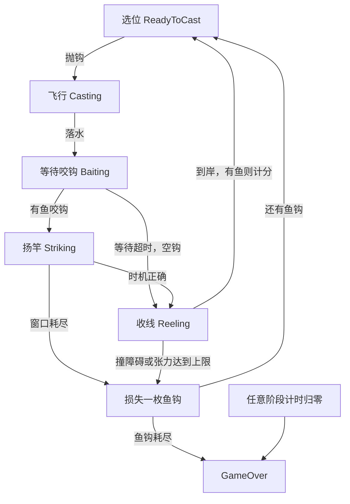

# Seven Seas 项目分析（重新核查版）

更新日期：2026 年 9 月 1 日

> 本文依据当前磁盘中的源码、Unity 场景、预制体和参数资产重新整理。分析属于静态审查，未运行 Unity、重新编译或完成手机 / WebGL 实测。“已有实现”表示代码和配置中存在相应路径，不表示所有运行情况均已验收。

## 1. 当前项目的总体判断

Seven Seas 是一个单人 2D 钓鱼游戏课程原型。README 要求基于 Angler Dangler（1982）进行改编，使用方向操作与单按钮，加入移动设备专属机制，并以复古精灵风格制作，最终发布为 itch.io 上的 HTML5 / WebGL 游戏。

当前主要玩法已经形成代码闭环：

**选择位置 → 抛钩 → 等待咬钩 → 扬竿时机判定 → 收线与躲避 → 得分或损失鱼钩 → 再次尝试 → 游戏结束。**

项目已经超出单纯的传感器实验阶段，具备一局游戏所需的计分、生命、时间与结算逻辑。接下来最重要的是补齐玩家反馈、手机收线输入以及游戏结束时的行为清理，而不是重新搭建玩法框架。

当前仍不能据此认定项目已经达到发布状态：输入平台之间存在缺口，张力机制缺少对应显示，边界情况需要实测，浏览器版本尚未在本次检查中验证。

### 本版对上次分析的更正

**主菜单已经配置了正式玩法入口。** `MainMenu.unity` 中的 `PlayButton` 是 `NavigateButton.prefab` 的实例；该预制体设置 `targetScene = 1`，通过 SceneCatalog 对应到 `FishingLoopTest`。只搜索场景内直接保存的字段，会漏掉从预制体继承的配置。上次“主菜单缺少正式玩法入口”的判断不准确，本版予以纠正。

本次没有发现核心玩法与上次阅读内容之间明显的新增机制；下面按当前实现重新归纳，并补充了预制体继承、水波生命周期与参数难度方面的分析。

## 2. 工程组成

### 2.1 技术配置

| 项目 | 当前配置 |
| --- | --- |
| Unity 编辑器 | 6000.3.23f1 |
| 主要语言 | C# |
| 渲染管线 | Universal RP 17.3.0，包含 2D Renderer 配置 |
| 输入系统 | Input System 1.20.0 |
| 摄像机 | Cinemachine 3.1.7 |
| 主要玩法界面 | UGUI / TextMesh Pro |
| 自有脚本规模 | Assets/Scripts 下 43 个 C# 文件；Assets/Editor 下 3 个 |
| 测试包 | Unity Test Framework 1.6.0；未在自有脚本和 Editor 目录发现 NUnit / UnityTest 用例 |

依赖列表中还包含动画、录制、AI、协作等工具包。安装某个包不代表游戏已经使用了对应玩法功能，不能仅凭依赖判断项目有联网或 AI 系统。

### 2.2 主要目录

```text
Assets/
  Scripts/
    Controller/       游戏状态、鱼钩、鱼、扬竿、收线、摄像机
    Input/            输入接口与键盘鼠标实现
    Manager/          常驻服务与姿态校准
    Help/             姿态、陀螺仪数据读取
    SceneManagement/  场景映射和加载
    Tracker/          分数、鱼钩生命、时间
    UI/               玩法 HUD、校准与调试界面
    Spawner/          鱼群生成
    Obstacle/         收线障碍标记
    WaterSplash/      水波生成与生命周期
  Scenes/             入口、菜单和实验 / 玩法场景
  Prefabs/            鱼、障碍和水面特效
  Engineer Folder/    参数资产、UI 预制体等
  Art Asset Folder/   角色、鱼、障碍、UI 等美术资源
  Tech Art Folder/    海面材质与 Shader Graph
  Editor/             场景搭建与调试辅助
Packages/             包依赖
ProjectSettings/      Unity 项目设置
docs/                 设计、教学、输入参考与本文
```

阅读项目时优先关注 Scripts、Scenes、Prefabs 和参数资产。Library、Temp、Logs 是生成数据，不是理解玩法的起点。

## 3. 启动与场景关系

当前构建列表包含以下五个场景，均已启用：

| 顺序 | 场景 | 作用 |
| --- | --- | --- |
| 0 | BootStrap | 创建常驻 AppRoot，然后加载 MainMenu |
| 1 | MainMenu | 正式玩法、体感实验与校准相关入口 |
| 2 | AttitudeControlTest | 倾斜控制实验 |
| 3 | GyroscopeCastTest | 甩动抛射实验 |
| 4 | FishingLoopTest | 完整钓鱼玩法场景 |

场景枚举不是构建索引。`SceneCatalog.asset` 单独将枚举映射为场景名称，其中 `GameScene = 1` 对应 FishingLoopTest；Settings 的场景名为空，不能把它当作已完成的独立设置场景。

正常启动路径为：

```text
BootStrap
  └─ AppRoot：保存输入读取、校准和场景加载服务
      └─ MainMenu
          └─ PlayButton → GameScene → FishingLoopTest
              └─ FishingSceneEntryGuard
                  ├─ 桌面 / Editor：直接启动 GameplayRoot
                  └─ 移动平台：校准完成后启动 GameplayRoot
```

AppRoot 使用 `DontDestroyOnLoad` 保留跨场景服务。移动端进入玩法前需要它提供传感器与校准服务。

Editor 可以直接打开 FishingLoopTest 调试键盘玩法，但此时通常没有 AppRoot。场景中的返回菜单按钮由 `SceneNavigationButton` 执行，它在 AppRoot 不存在时只报错并返回。**直接测试玩法与从 BootStrap 测试菜单往返，是两种不同测试方式。**

## 4. 玩法核心结构

### 4.1 状态机

`FishingLoopController` 是总协调器，控制六个状态：

| 状态 | 玩家行为 / 系统行为 | 结束条件 |
| --- | --- | --- |
| ReadyToCast | 左右选位，等待抛钩 | 获得抛钩输入 |
| Casting | 鱼钩向水域飞行 | 鱼钩报告 Landed |
| Baiting | 候选鱼游向鱼钩 | 鱼咬钩，或等待超时 |
| Striking | 在收缩圆环进入目标带时输入 | 成功，或总窗口超时 |
| Reeling | 自动回收、左右躲避、按住加速 | 到岸、撞障碍或断线 |
| GameOver | 关闭玩法输入，显示最终分数 | 当前控制器中没有直接重开状态路径 |



### 4.2 组件职责

| 组件 | 主要职责 |
| --- | --- |
| FishingLoopController | 状态转换、输入开关、成功失败结算 |
| ShoreLaneController | 岸边选位与边界约束 |
| FishingHookController | 停靠、发射、线性飞行与落水事件 |
| FishBiteRaceController | 搜索候选鱼、唯一赢家判定、等待超时 |
| FishController | Idle / Approaching / Hooked 行为与跟随鱼钩 |
| StrikeController | 扬竿计时、目标带命中、错误输入冷却 |
| StrikeWindowHUD | 目标圆环和收缩环的表现 |
| ReelingController | 自动收线、横移、加速、张力与碰撞失败 |
| FishingCameraController | 全景 / 跟钩镜头切换，扬竿错误震动 |
| ScoreTracker / HookTracker / SessionTimer | 分数、鱼钩数量和倒计时 |
| FishingSessionHUD | 分数、生命、时间和结束面板 |

整体以事件连接各环节。例如鱼钩只发布落水事件，是否进入 Baiting 由总控制器决定。这是当前架构的主要优点，适合继续扩展和调参。

### 4.3 关键行为说明

- **飞行**：力度映射到沿世界 +Y 方向的距离，使用线性插值移动。独立抛射实验与正式玩法使用不同组件，不能把实验场景中的抛物线当作正式场景已经实现的效果。
- **咬钩**：开始等待时搜索吸引范围内的鱼，候选鱼一起靠近。管理器挑选一个赢家，其余恢复 Idle。它不是持续扫描新鱼进入范围的系统。
- **扬竿**：错误输入不会立刻扣鱼钩，而是进入冷却；总窗口结束才判定失败。手机使用即时的手势阈值事件，避免等待抛钩力度采样。
- **收线**：横移张力依据夹紧到边界之后的实际位移计算。顶住边界继续按方向时，实际横移速度为零，不会凭输入意图继续累加横移张力。
- **结算**：鱼到岸后加分并禁用鱼对象；空钩不加分；撞障碍、断线或扬竿超时损失一枚鱼钩。
- **鱼群**：只在开局生成，捕获后不补充。Idle 不主动巡游，失败时恢复 Idle 也不会回到出生点。

## 5. 操作与平台完成情况

`FishingInputSource` 抽象了 Move、Cast、Strike、Accelerate，但目前只有键盘鼠标具体实现。手机姿态与甩动部分仍从控制器或检测器直接接入。

| 行为 | 桌面 | 移动端现状 |
| --- | --- | --- |
| 岸边左右移动 | A / D | 已有校准姿态控制 |
| 抛钩 | Space 或鼠标左键 | 已有陀螺仪甩动检测 |
| 扬竿 | Space | 已有第二个手势检测器 |
| 收线左右躲避 | A / D | 未发现向收线 MoveInput 提供姿态值的具体输入类 |
| 加速收线 | 按住 Space | 未发现完整触屏加速输入实现 |

键盘抛钩使用固定力度 1，手机抛钩则由甩动峰值映射力度。因此，两种平台的距离控制体验目前不等价。

扬竿成功后，如果 Space 尚未松开，代码会要求先释放再按住，才允许加速。这能避免同一按键跨阶段误触。

**判断：桌面玩法路径最完整；已有手机体感基础，但不能称为所有阶段均支持完整手机操作。**

## 6. 当前保存参数与难度含义

以下取自当前场景、BasicFish 预制体与 Profile 资产。Unity 的场景保存值可能覆盖脚本默认值，应优先看实际引用的资产和 Inspector。

| 参数 | 当前值 |
| --- | --- |
| 初始鱼钩 | 5 |
| 单局时间 | 90 秒 |
| 开局鱼数量 | 8；空间不足时生成器允许少于目标数量 |
| 当前基础鱼分值 / 游速 | 1 分 / 2 单位每秒 |
| 抛钩距离 | 2–15 单位 |
| 飞行时间 | 0.75 秒 |
| 吸引半径 / 咬钩距离 | 4 / 0.25 单位 |
| 等待上限 | 8 秒 |
| 扬竿窗口 / 错误冷却 | 1.5 秒 / 0.35 秒 |
| 扬竿目标带内 / 外半径 | 0.498 / 0.63（归一化） |
| 正常 / 加速收线速度 | 2 / 4 单位每秒 |
| 横向躲避速度 | 4 单位每秒 |
| 张力被动衰减 / 加速增量 | 0.8 / 1.2 每秒 |
| 安全横移速度 / 横移评估上限 | 1.33 / 4 |
| 横移最大张力增量 | 1.4 每秒 |
| BasicFish 水波生成间隔 | 0.5 秒 |
| WaterRipple 生命周期配置 | 0.8 秒 |

### 6.1 扬竿的有效窗口比总计时短得多

圆环从半径 1 线性缩到 0，按当前参数计算，正确输入区间约为开始后的 **0.555–0.753 秒**，只有 **0.198 秒**。

0.35 秒的错误冷却比有效区间更长。虽然代码允许重试，但如果玩家刚好在正确区间前按错，冷却可能直接覆盖剩余正确时机。应通过试玩确认这是否符合“容易上手”的目标，而不是只看 1.5 秒总窗口。

以上是理论区间，实际判定还受逐帧更新时间影响。

### 6.2 加速与横移叠加的惩罚很强

张力计算可概括为：

```text
每秒张力变化 = -被动衰减 + 加速贡献 + 实际横移贡献
张力 = 限制到 0–1 的当前张力 + 时间累计变化
```

| 持续动作 | 张力净增长 / 秒 | 从 0 到断线的理论时间 |
| --- | --- | --- |
| 不加速、不横移 | -0.8 | 不会因此断线 |
| 只加速 | 0.4 | 2.5 秒 |
| 满速横移，不加速 | 0.6 | 约 1.67 秒 |
| 加速且满速横移 | 1.8 | 约 0.56 秒 |

这些结果假设动作持续、没有提前到岸、撞障碍或顶住边界。尤其最后一种动作，玩家如果看不到张力反馈，就可能难以理解失败原因。

## 7. 问题清单与处理优先级

### P1：影响完整体验的问题

**A. 张力逻辑已存在，但缺少可见张力反馈。**

依据：`Tension01` 在自有脚本中只被 ReelingController 使用，FishingSessionHUD 只显示分数、鱼钩和时间。建议先加张力条与接近断线时的提示，再决定是否调整增长速率。

**B. 手机收线输入尚未贯通。**

依据：岸边控制读取 AttitudeReader，ReelingController 只读取 FishingInputSource，而当前具体子类只有键盘鼠标版本。建议让手机横移和触屏按钮输出相同的玩法意图，再真机验证整局游戏。

**C. GameOver 尚未取消飞行和咬钩竞赛。**

依据：ExitCasting 与 ExitBaiting 为空；EnterGameOver 关闭输入并取消收线，但没有停止飞行或竞赛的调用。若时间在 Casting / Baiting 归零，底层对象仍可能移动、落水或选出赢家。总状态机虽然忽略了过期事件，底层状态和画面仍可能改变。

建议提供相应取消入口，并逐一测试在每个阶段耗尽时间的结果。

### P2：配置和可维护性问题

**D. 岸边边界检查只覆盖“两个都缺失”。**

ShoreLaneController 使用 `leftLaneLimit == null && rightLaneLimit == null`，随后访问两个对象的位置。只缺一个引用时仍会继续执行并发生空引用。应覆盖任意一个边界缺失的情况。

**E. 多个 MonoBehaviour 文件名与类名不一致。**

| 文件 | 声明的类 |
| --- | --- |
| ReelingObstable.cs | ReelingObstacle |
| WaterVFX_Destroy.cs | RippleLifetime |
| OnCollisionEnter2D.cs | PlayerHazard |

其中 WaterRipple 预制体确实引用 WaterVFX_Destroy.cs 对应 GUID，并保存 RippleLifetime 标识。建议在 Unity 中检查组件是否被正确识别，再统一命名并保留 `.meta` GUID。本次未运行 Unity，不能仅凭命名断言当前组件已经失效。

水波尤其值得检查：BasicFish 每 0.5 秒生成一个水波，预期 0.8 秒后销毁。如果生命周期组件失效，对象可能持续累积。应在运行时观察 Hierarchy 中水波数量是否稳定。

**F. 参数资产中的震动值尚未接到镜头。**

StrikeWindowProfile 暴露 ShakeAmplitude / ShakeDuration；FishingCameraController 只对场景中的 Impulse Source 调用 GenerateImpulse，没有读取这两个属性。资产字段与实际震动配置可能形成两个来源，容易导致“改了数值却没效果”。

**G. 直接打开玩法场景时，返回菜单不能正常使用。**

这是 AppRoot 依赖带来的调试入口限制。正式菜单已经有 PlayButton，不需要重复新建入口；应从 BootStrap 验证“开始 → 结束 / 返回 → 再开始”。如果团队需要直接运行场景时也能导航，再单独完善编辑器启动策略。

**H. 收线失败与到岸发生在同一帧时，代码优先断线。**

ReelingController 先移动并累加张力，检查断线后才检查到岸。如果同一帧到岸且张力达到 1，会判失败。这是现有判定顺序，不一定是错误，但应明确是否符合设计。

### P3：后续扩展与记录

- 鱼被捕获后不补充。当前只有一种生成预制体，每条 1 分，意味着这批初始生成鱼最多贡献 8 分；若实际生成不足则更少。这是有限鱼群的结果，需要确认是否符合目标节奏。
- 鱼饵摆动、正式抛物线表现、更丰富的鱼种行为尚未在当前核心实现中体现。
- 自有源码中未发现专门的玩法自动化用例；优先测试重复结算、结束状态和边界时机。
- progress.md 仍记录部分计分、断线工作待做，但代码已包含实现。后续应同步进度，避免重复开发。
- 旧 PlayerHazard 仍包含碰 Hazard 后直接重载场景的逻辑。清理前先确认引用，避免与当前“失败扣钩”规则混用。

## 8. 发布与性能判断

### WebGL 尚需实际验证

发布目标是浏览器游戏。当前源码以 Unity 输入与移动平台分支为主，自有 Assets 中未发现 `.jslib`。这不等于断定 WebGL 无法使用体感，但目前证据不足以证明浏览器输入链路已完成。

后续应使用实际 WebGL 构建，分别验证桌面浏览器和目标手机浏览器的输入、校准、画面、菜单往返及结束流程。原生手机测试不能替代浏览器版本测试。

### 性能目前不宜先做大规模重构

鱼群规模较小，候选鱼搜索发生在每次开始咬钩时，当前没有仅凭源码就必须引入复杂空间索引的理由。

更实际的观察点是：水波生命周期是否可靠、特效创建销毁频率、HUD 每帧字符串更新，以及手机 / WebGL 帧率。先测量，再决定是否使用对象池或优化 HUD 更新频率。

## 9. 如何体验与验收

### 快速检查玩法

1. 用 Unity 6000.3.23f1 打开工程，等待导入与编译完成。
2. 打开 FishingLoopTest，进入 Play Mode，将焦点放到 Game 视图。
3. A/D 选位，Space 或鼠标左键抛钩。
4. 鱼咬钩后，圆环进入目标带时按 Space。
5. 收线时 A/D 躲避；先松开再按住 Space 加速。
6. 检查成功加分、失败扣钩和倒计时结束。当前张力仍需结合调试数据观察。

### 完整验收清单

| 场景 | 预期结果 |
| --- | --- |
| 从 BootStrap 启动并点击 PlayButton | 进入 FishingLoopTest |
| 成功钓鱼两次 | 每次只加一次分，可以重复抛钩 |
| 没有鱼咬钩 | 等待超时后空钩收回，不加分 |
| 错误扬竿与超时 | 错误输入触发冷却，窗口耗尽只扣一钩 |
| 收线撞障碍或断线 | 只失败一次，释放鱼，正确回到选位或结束 |
| 顶住横向边界 | 实际横移速度归零 |
| 分别在各阶段计时归零 | 输入和底层玩法行为都停止 |
| 最后一枚鱼钩丢失 | 显示最终分数，不再接受玩法输入 |
| 运行一段时间观察水波 | 对象数量稳定，不持续累积 |
| 返回菜单后再次开始 | 新局分数、生命、时间和鱼群正确初始化 |
| 手机完整游玩 | 校准、选位、抛钩、扬竿、躲避和加速均可操作 |
| 实际 WebGL 页面游玩 | 输入、显示和流程与发布目标一致 |

建议顺序：**修明确的引用检查与组件命名问题 → 补张力显示 → 完成结束状态清理 → 贯通手机收线输入 → 实测并调整难度 → 验证 WebGL 发布流程。**

## 10. 进一步阅读

下表路径相对于工程根目录；Controller 内简称均位于 `Assets/Scripts/Controller/`。

| 想理解的内容 | 优先阅读 |
| --- | --- |
| 课程规则 | README.md |
| 整局游戏 | FishingLoopController.cs |
| 操作接口 | Assets/Scripts/Input/ |
| 选位和飞行 | ShoreLaneController.cs、FishingHookController.cs |
| 鱼群和咬钩 | FishController.cs、FishBiteRaceController.cs、Assets/Scripts/Spawner/FishSpawner.cs |
| 扬竿 | StrikeController.cs、Assets/Scripts/UI/StrikeWindowHUD.cs |
| 收线与张力 | ReelingController.cs、ReelTuningProfile.cs |
| 当前调参数值 | Assets/Engineer Folder/Profiles/ |
| 计分生命时间 | Assets/Scripts/Tracker/ |
| 场景真实挂载 | Assets/Scenes/FishingLoopTest.unity |
| 菜单入口继承 | Assets/Scenes/MainMenu.unity、Assets/Engineer Folder/Prefabs/UI/NavigateButton.prefab |
| 体感背景 | docs/reference/motion-input-guide.md |
| 设计意图 | docs/design/2026-08-29-fishing-loop-design.md |

当前架构值得保留。接下来应集中提高一局游戏的可理解性与可靠性，让玩家知道何时操作、为什么失败，以及在不同设备上如何完成同一套玩法。
